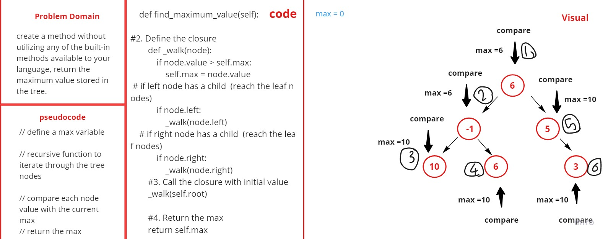

# data-structures-and-algorithms-python-401

The PR Link : [PR](https://github.com/aghyadalbalkhi-ASAC/data-structures-and-algorithms-python-401/pull/15)

# find-maximum-value
*create a method without utilizing any of the built-in methods available to your language, return the maximum value stored in the tree.*

# Challenge Summary
<!-- Short summary or background information -->

*dealing with recursive*

## Challenge Description
<!-- Description of the challenge -->

*create find-maximum-value method*

## Check List
- [x] Can successfully instantiate an empty tree
- [x] Return the maximum value in Binary Tree

## Solution
<!-- Embedded whiteboard image -->

